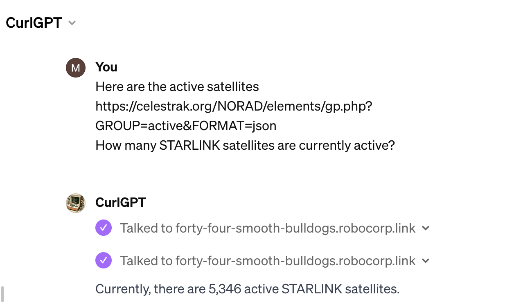

# Actions for Analyzing Large JSON Data from the Internet

## Overview
This package provides a set of actions tailored for fetching and analyzing large JSON data directly from internet sources. Ideal for interacting with APIs, these actions enable you to execute cURL commands and apply JMESPath queries to JSON responses.

## Key Features
- **Fetch Data Efficiently**: Easily retrieve large JSON data (up to several MBs) from online APIs.
- **Advanced JSON Manipulation**: Perform complex JMESPath queries on the JSON responses for in-depth data analysis.
- **Local Storage of Responses**: Responses and query results are saved locally, allowing for subsequent review and validation.
- **User-Friendly Interface**: Access and manipulate data with simple commands with ChatGPT, suited for both beginners and advanced users.

## Example Use Case: Exploring Satellite Data from Celestrak



### Scenario
Imagine you're interested in space and want to analyze real-time data about satellites. For instance, you might want to know how many STARLINK satellites are currently active, or get specific details about a particular satellite.

### How This Package Helps
Our actions make this exploration effortless and informative, even if you're not familiar with technical data fetching or JSON querying methods.

### Process
1. **Initiate a Query**: You start a conversation in ChatGPT, expressing your interest in satellite data from Celestrak. For example, you might ask, "How many STARLINK satellites are currently active?" and point to the url https://celestrak.org/NORAD/elements/gp.php?GROUP=active&FORMAT=json 
2. **Behind-the-Scenes Action**: CurlGPT, acting as your assistant, uses a pre-formulated cURL command to fetch the latest satellite data from Celestrak's API.
3. **Data Analysis and Presentation**: Once the data is retrieved, CurlGPT applies a JMESPath query to extract and present the specific information you requested – in this case, the number of active STARLINK satellites.
4. **Further Exploration**: You can continue the conversation, asking for more details about a specific satellite, such as its orbital parameters or launch date. CurlGPT will refine the data search accordingly and provide you with the information in an easy-to-understand format.

### What You Accomplish
- **Gain Insights Without Technical Expertise**: You don't need to know how to write cURL commands or JMESPath queries. Just ask your question, and the tool does the rest.
- **Access Up-to-Date Information**: Get the latest data directly from sources like Celestrak, ensuring you have the most current information at your fingertips.
- **Engage in Interactive Learning**: Explore your interests in space or other subjects by engaging in an interactive, conversational manner.
- **Save Time**: Quickly get the information you need without manual data fetching and filtering.

## Installation and Usage: Creating Your Own CurlGPT

### Prerequisites
Before you begin, ensure you have:
- **Action Server Installed**: This package requires an [Action Server](https://github.com/robocorp/robocorp) to function.
- **OpenAI ChatGPT Account**: You'll need an account to access and use ChatGPT features.

### Setting Up the Action Server
1. **Start the Action Server**:
   - Open your terminal and run the following command:
     ```bash
     action-server start --expose
     ```
   - Once started, the terminal will display important information. Take note of the following:
```
  ⚡️ Local Action Server: http://localhost:8080
  🌍 Public URL: <PUBLIC URL> (You will use this in the GPT editor)
  🔑 API Authorization Bearer key: <TOKEN> (This is your API key)
```

### Configuring CurlGPT in OpenAI's Editor
2. **Access the GPT Editor**:
   - Visit [OpenAI New GPT Editor](https://chat.openai.com/gpts/editor).
   - Select `Create new action`.

3. **Import Action Server**:
   - Click on `Import from URL`.
   - Paste the `<PUBLIC URL>` from your action server into the field provided.

4. **Set Up Authentication**:
   - Choose `Authentication Type` as \"API KEY\".
   - Set `Auth Type` to \"Bearer\".
   - Enter your `<TOKEN>` as the API Key.

5. **Finalize Your CurlGPT**:
   - Name your GPT (e.g., CurlGPT).
   - Save the configuration to create your CurlGPT tool.
   - Make sure to expose it to your account for personal use.

### Ready to Explore
Now you have your very own CurlGPT! It's connected to your local Action Server, enabling you to explore and analyze data from the internet directly through ChatGPT.
