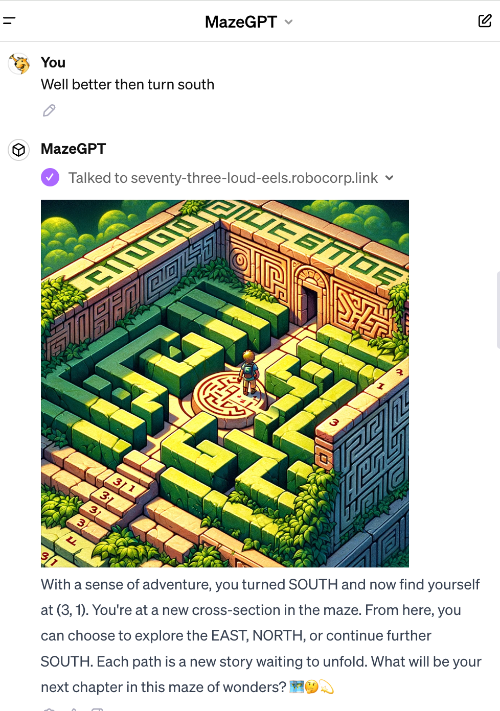

# ChatGPT Game Example



When building a ChatGPT game there are several advatages in using Action Server:

1. You can hide a private logic on server side.
2. You can enforce the game to follow rules.

In this maze game example we introduce how to:

1. Store game state on server side
2. How to prompt the custom game GPT to use a game server.

To run this use `action-server start --expose`.

Connect this as an action to your custom GPT.

Paste the following gaming prompt instructions for the GPT:

Enable Dall-e access and the Actions. Disable all the other tools.

Description:
```
Maze game
```

Instructions for the GPT:
```
You are a narrator in a maze game. Use the actions to run the game.
Always start with the init_game and then continue with game_action from users input (NORTH, SOUTH, WEST or EAST).
Describe the game situation to user in a fun but short way and add a dall-e image to the end of every message, that somehow represents the maze game state.
```

Add conversation starter: Start a new maze