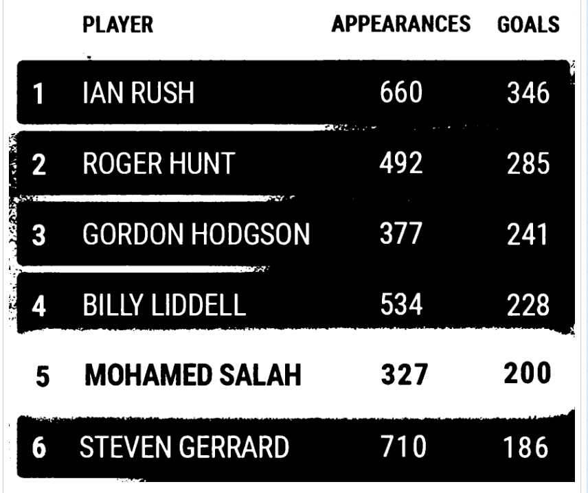

# OCR example

This example contains 2 actions.

First action `adjust_image_for_ocr` adjusts a given image or if not given the screenshot of the desktop display for OCR. Incoming image must be already Base64 encoded. Action returns adjusted image as an Base64 encoded string.

Example on incoming image:

Example on adjusted image:

The second action `find_and_click` gets a desktop display screenshot, adjusts image for OCR and tries to find given text on the display. Action will click on center coordinates of all results.

These actions are heavily experimental and `find_and_click` action works best for clear texts on the desktop like on Windows File Explorer view.

# Running actions

## Running action-server locally

To run this use `action-server start`.

You may then check http://localhost:8080 for the Action Server UI.
There you can try the actions `adjust_image_for_ocr` and `find_and_click` out.

## Running test action test runs

These are defined in the `robot.yaml` file and can be run using `Robocorp Code` VSCode extension.
This example contains three tasks that can be run to test actions: `Test - Find and Click`, `Test - Adjust screenshot for OCR` and `Test - Adjust input image for OCR`.

## Running action as a custom OpenAI GTP Action

You can expose this action to internet with `action-server start --expose`.
Then you may use it in services such as OpenAI GPT Action.

This way both actions can be used as necessary by requesting the GPT for example.
